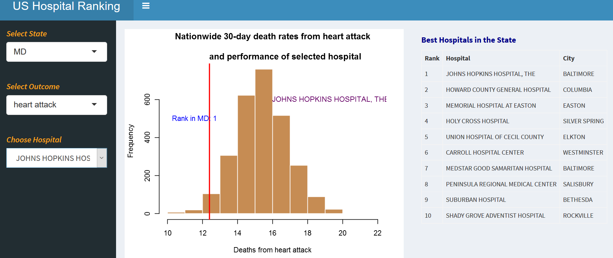
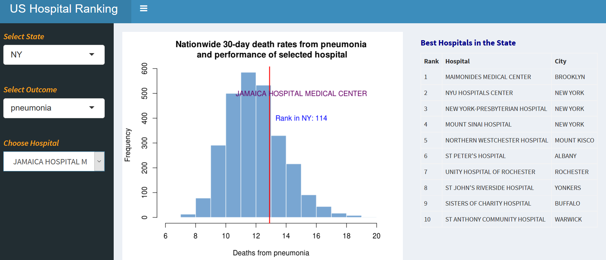

This is my shiny app that helps to see the performances of various US hospitals in heart attack, heart failure and pneumonia.  The data is from the Hospital Compare web site, which is run by the U.S. Department of Health and Human Services.

We can select a state and outcome and see the best hospitals in the state. Further, we can select a hospital from the drop down menu and see its rank in the state and compare its performance with all hospitals across the nation.

The screenshot below shows the top ten best hospitals in heart attack in MD. We also see that Johns Hopkins Hospital is the best hospital in the state and the vertical line shows average 30-day death rate in the hospital. The histogram is the average 30-day death rate from all hospitals in the USA.

Similarly, the screenshot below shows top ten best hospitals in NY in pneumonia. In the histogram, we see that Jamaica Hospital Medical Center is ranked 114. When we change the state, the hospital drop down menu in the left shows all hospitals in the selected state. Then, we can select any hospital from the drop down menu to see what its rank is and where in the histogram the average 30-day death rate in the hospital lies.

You can try the app by clicking <a href="https://fishdata.shinyapps.io/hospital_ranking/">here</a>.

